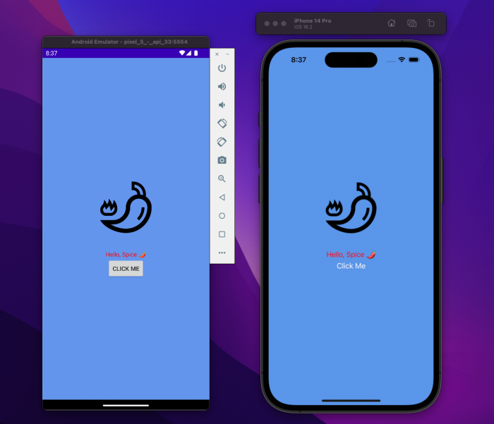
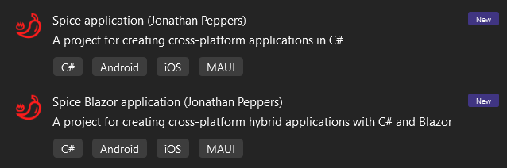
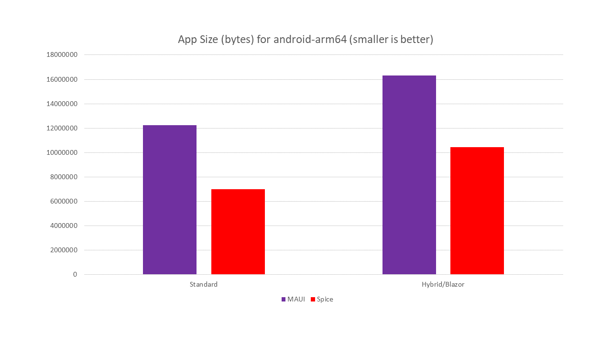
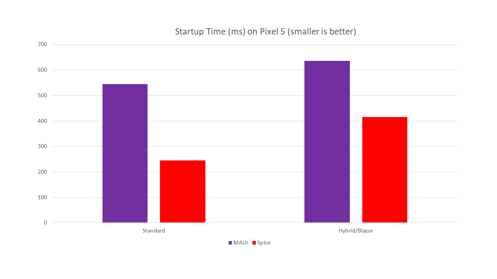
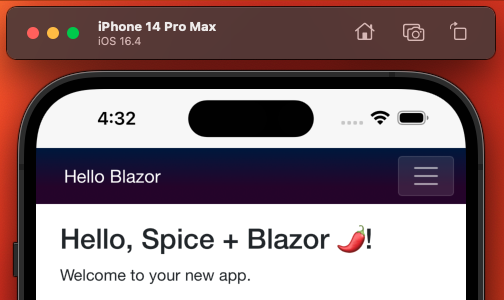
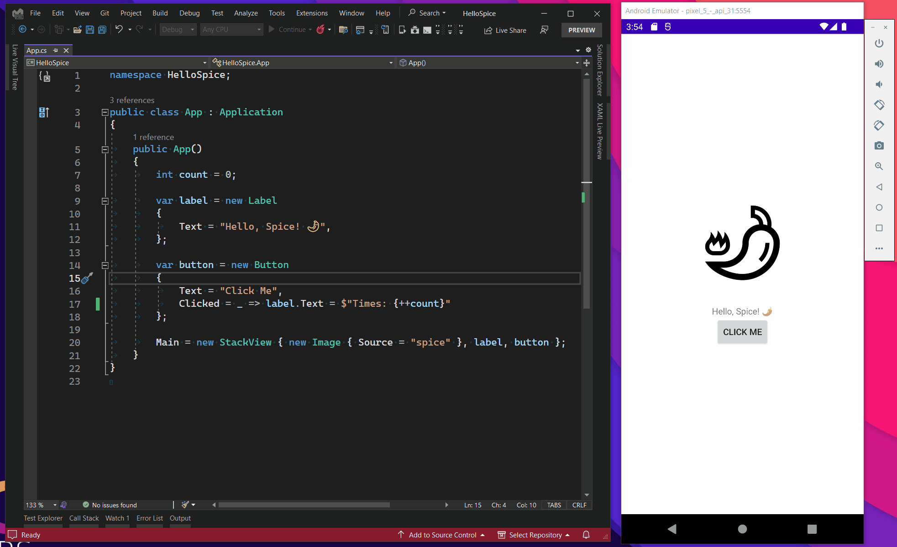

# Spice 🌶, a spicy cross-platform UI framework!

A prototype (and design) of API minimalism for mobile.

If you like this idea, star for approval! Read on for details!



## Getting Started

Simply install the template:

```sh
dotnet new install Spice.Templates
```

Create either a plain Spice project, or a hybrid "Spice+Blazor" project:

```sh
dotnet new spice
# Or if you want hybrid/web support
dotnet new spice-blazor
```

Or use the project template in Visual Studio:



Build it as you would for other .NET MAUI projects:

```sh
dotnet build
# To run on Android
dotnet build -f net10.0-android -t:Run
# To run on iOS
dotnet build -f net10.0-ios -t:Run
```

Of course, you can also just open the project in Visual Studio and hit F5.

## Startup Time & App Size

In comparison to a `dotnet new maui` project, I created a Spice
project with the same layouts and optimized settings for both project
types. (`AndroidLinkMode=r8`, etc.)

App size of a single-architecture `.apk`, built for `android-arm64`:



The average startup time of 10 runs on a Pixel 5:



This gives you an idea of how much "stuff" is in .NET MAUI.

In some respects the above comparison isn't completely fair, as Spice
🌶 has very few features. However, Spice 🌶 is [fully
trimmable][trimming], and so a `Release` build of an app without
`Spice.Button` will have the code for `Spice.Button` trimmed away. It
will be quite difficult for .NET MAUI to become [fully
trimmable][trimming] -- due to the nature of XAML, data-binding, and
other System.Reflection usage in the framework.

[trimming]: https://learn.microsoft.com/dotnet/core/deploying/trimming/prepare-libraries-for-trimming

## Background & Motivation

In reviewing, many of the *cool* UI frameworks for mobile:

* [Flutter](https://flutter.dev)
* [SwiftUI](https://developer.apple.com/xcode/swiftui/)
* [Jetpack Compose](https://developer.android.com/jetpack/compose)
* [Fabulous](https://fabulous.dev/)
* [Comet](https://github.com/dotnet/Comet)
* An, of course, [.NET MAUI](https://dotnet.microsoft.com/apps/maui)!

Looking at what apps look like today -- it seems like bunch of
rigamarole to me. Can we build mobile applications *without* design
patterns?

The idea is we could build apps in a simple way, in a similar vein as
[minimal APIs in ASP.NET Core][minimal-apis] but for mobile & maybe
one day desktop:

```csharp
public class App : Application
{
    public App()
    {
        int count = 0;
    
        var label = new Label
        {
            Text = "Hello, Spice 🌶",
        };
    
        var button = new Button
        {
            Text = "Click Me",
            Clicked = _ => label.Text = $"Times: {++count}"
        };
    
        Main = new StackView { label, button };
    }
}
```

These "view" types are mostly just [POCOs][poco].

Thus you can easily write unit tests in a vanilla `net10.0` Xunit
project, such as:

```csharp
[Fact]
public void Application()
{
    var app = new App();
    var label = (Label)app.Main.Children[0];
    var button = (Button)app.Main.Children[1];

    button.Clicked(button);
    Assert.Equal("Times: 1", label.Text);

    button.Clicked(button);
    Assert.Equal("Times: 2", label.Text);
}
```

The above views in a `net10.0` project are not real UI, while
`net10.0-android` and `net10.0-ios` projects get the full
implementations that actually *do* something on screen.

So for example, adding `App` to the screen on Android:

```csharp
protected override void OnCreate(Bundle? savedInstanceState)
{
    base.OnCreate(savedInstanceState);

    SetContentView(new App());
}
```

And on iOS:

```csharp
var vc = new UIViewController();
vc.View.AddSubview(new App());
Window.RootViewController = vc;
```

`App` is a native view on both platforms. You just add it to an the
screen as you would any other control or view. This can be mix &
matched with regular iOS & Android UI because Spice 🌶 views are just
native views.

[poco]: https://en.wikipedia.org/wiki/Plain_old_CLR_object
[minimal-apis]: https://learn.microsoft.com/aspnet/core/fundamentals/minimal-apis

## *NEW* Blazor Support

Currently, Blazor/Hybrid apps are strongly tied to .NET MAUI. The
implementation is basically working with the plumbing of the native
"web view" on each platform. So we could have implemented
`BlazorWebView` to be used in "plain" `dotnet new android` or
`dotnet new ios` apps. For now, I've migrated some of the source code
from `BlazorWebView` from .NET MAUI to Spice 🌶, making it available
as a new control:

```csharp
public class App : Application
{
    public App()
    {
        Main = new BlazorWebView
        {
            HostPage = "wwwroot/index.html",
            RootComponents =
            {
                new RootComponent { Selector = "#app", ComponentType = typeof(Main) }
            },
        };
    }
}
```

From here, you can write `Index.razor` as the Blazor you know and love:

```razor
@page "/"

<h1>Hello, world!</h1>

Welcome to your new app.
```

To arrive at Blazor web content inside iOS/Android apps:



This setup might be particularly useful if you want web content to
take full control of the screen with minimal native controls. No need
for the app size / startup overhead of .NET MAUI if you don't actually
have native content?

## Scope

* No XAML. No DI. No MVVM. No MVC. No data-binding. No System.Reflection.
  * *Do we need these things?*
* Target iOS & Android only to start.
* Implement only the simplest controls.
* The native platforms do their own layout.
* Document how to author custom controls.
* Leverage C# Hot Reload for fast development.
* Measure startup time & app size.
* Profit?

Benefits of this approach are full support for [trimming][trimming]
and eventually [NativeAOT][nativeaot] if it comes to mobile one day. 😉

[nativeaot]: https://learn.microsoft.com/dotnet/core/deploying/native-aot/

## Thoughts on .NET MAUI

.NET MAUI is great. XAML is great. Think of this idea as a "mini"
MAUI.

Spice 🌶 will even leverage various parts of .NET MAUI:

* The iOS and Android workloads for .NET.
* The .NET MAUI "Single Project" system.
* The .NET MAUI "Asset" system, aka Resizetizer.
* Microsoft.Maui.Graphics for primitives like `Color`.

And, of course, you should be able to use Microsoft.Maui.Essentials by
opting in with `UseMauiEssentials=true`.

It is an achievement in itself that I was able to invent my own UI
framework and pick and choose the pieces of .NET MAUI that made sense
for my framework.

## Implemented Controls

* `View`: maps to `Android.Views.View` and `UIKit.View`.
* `Label`: maps to `Android.Widget.TextView` and `UIKit.UILabel`
* `Button`: maps to `Android.Widget.Button` and `UIKit.UIButton`
* `StackView`: maps to `Android.Widget.LinearLayout` and `UIKit.UIStackView`
* `Image`: maps to `Android.Widget.ImageView` and `UIKit.UIImageView`
* `Entry`: maps to `Android.Widget.EditText` and `UIKit.UITextField`
* `WebView`: maps to `Android.Webkit.WebView` and `WebKit.WKWebView`
* `BlazorWebView` extends `WebView` adding support for Blazor. Use the
  `spice-blazor` template to get started.

## Custom Controls

Let's review an implementation for `Image`.

First, you can write the cross-platform part for a vanilla `net10.0`
class library:

```csharp
public partial class Image : View
{
    [ObservableProperty]
    string _source = "";
}
```

`[ObservableProperty]` comes from the [MVVM Community
Toolkit][observable] -- I made use of it for simplicity. It will
automatically generate various `partial` methods,
`INotifyPropertyChanged`, and a `public` property named `Source`.

We can implement the control on Android, such as:

```csharp
public partial class Image
{
    public static implicit operator ImageView(Image image) => image.NativeView;

    public Image() : base(c => new ImageView(c)) { }

    public new ImageView NativeView => (ImageView)_nativeView.Value;

    partial void OnSourceChanged(string value)
    {
        // NOTE: the real implementation is in Java for performance reasons
        var image = NativeView;
        var context = image.Context;
        int id = context!.Resources!.GetIdentifier(value, "drawable", context.PackageName);
        if (id != 0) 
        {
            image.SetImageResource(id);
        }
    }
}
```

This code takes the name of an image, and looks up a drawable with the
same name. This also leverages the .NET MAUI asset system, so a
`spice.svg` can simply be loaded via `new Image { Source = "spice" }`.

Lastly, the iOS implementation:

```csharp
public partial class Image
{
    public static implicit operator UIImageView(Image image) => image.NativeView;

    public Image() : base(_ => new UIImageView { AutoresizingMask = UIViewAutoresizing.None }) { }

    public new UIImageView NativeView => (UIImageView)_nativeView.Value;

    partial void OnSourceChanged(string value) => NativeView.Image = UIImage.FromFile($"{value}.png");
}
```

This implementation is a bit simpler, all we have to do is call
`UIImage.FromFile()` and make sure to append a `.png` file extension
that the MAUI asset system generates.

Now, let's say you don't want to create a control from scratch.
Imagine a "ghost button":

```csharp
class GhostButton : Button
{
    public GhostButton() => NativeView.Alpha = 0.5f;
}
```

In this case, the `NativeView` property returns the underlying
`Android.Widget.Button` or `UIKit.Button` that both conveniently have
an `Alpha` property that ranges from 0.0f to 1.0f. The same code
works on both platforms!

Imagine the APIs were different, you could instead do:

```csharp
class GhostButton : Button
{
    public GhostButton
    {
#if ANDROID
        NativeView.SomeAndroidAPI(0.5f);
#elif IOS
        NativeView.SomeiOSAPI(0.5f);
#endif
    }
}
```

Accessing the native views don't require any weird design patterns.
Just `#if` as you please.

[observable]: https://learn.microsoft.com/dotnet/communitytoolkit/mvvm/generators/observableproperty

## Hot Reload

C# Hot Reload (in Visual Studio) works fine, as it does for vanilla .NET
iOS/Android apps:



Note that this only works for `Button.Clicked` because the method is
invoked when you click. If the method that was changed was already
run, *something* has to force it to run again.
[`MetadataUpdateHandler`][muh] is the solution to this problem, giving
frameworks a way to "reload themselves" for Hot Reload.

Unfortunately, [`MetadataUpdateHandler`][muh] does not currently work
for non-MAUI apps in Visual Studio 2022 17.5:

```csharp
[assembly: System.Reflection.Metadata.MetadataUpdateHandler(typeof(HotReload))]

static class HotReload
{
    static void UpdateApplication(Type[]? updatedTypes)
    {
        if (updatedTypes == null)
            return;
        foreach (var type in updatedTypes)
        {
            // Do something with the type
            Console.WriteLine("UpdateApplication: " + type);
        }
    }
}
```

The above code works fine in a `dotnet new maui` app, but not a
`dotnet new spice` or `dotnet new android` application.

And so we can't add proper functionality for reloading `ctor`'s of
Spice 🌶 views. The general idea is we could recreate the `App` class and
replace the views on screen. We could also create Android activities
or iOS view controllers if necessary.

Hopefully, we can implement this for a future release of Visual Studio.

[muh]: https://learn.microsoft.com/dotnet/api/system.reflection.metadata.metadataupdatehandlerattribute
